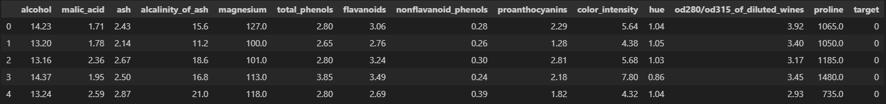

# Problem statement

Suppose, you are a new hire at Fusemachines. Previously, an intern was tasked to create a sample codebase for giving a knowledge sharing session "how to structure an ML project". They have left the company, and left the codebase as a mess. Here is the tree of the project:

```bash
.
├── assets/ - Keep images of the project
├── app.py - FastAPI based API
├── fetch_features.py - script to 
├── model_pipeline.py - script to 
├── README.md - Project's description
├── requirements.txt - library/packages description
└── wine_data.db - dataset to use
```

__Your supervisor has assigned you a task to pick up the codebase back and complete and codebase and fix the bug, where present.__

The dataset used in the following task is:



# Your TO-DOs for this assignment

1. Clone this repository in your local workstation. Install python, if you don't have it.
2. Create a branch from main. Name it as `assignment-<your_first_name>-<your_last_name>`.
3. Create a virtual environment using __python-venv__.
4. Install the required packages using `requirements.txt`.
5. Make the changes in the scripts as described within them.
6. Run app.py `uvicorn app:app --reload`, and send inference request using

```bash
curl -X 'POST' \
  'http://localhost:8000/predict/' \
  -H 'accept: application/json' \
  -H 'Content-Type: application/json' \
  -d '{
  "alcohol": 12.3,
  "flavanoids": 2.8,
  "total_phenols": 2.5
}'
```

7. Create a .gitignore file and ignore pkl, csv, and virtual environment directory.
8. Push the code to your branch.
9. Create a PR. 